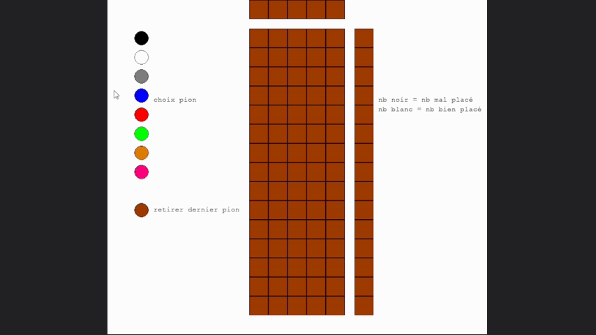

# Mastermind-SAE101

A Python school project to better understanding of fundamental algorithms and introduce the use of graphic librairies like Pygame. This project presents a fully functional Mastermind game where the user can play until they find the secret code or exhaust their tries.

## Table of Contents
- [Overview](#overview)
- [How-to-play](#how-to-play)
- [Gameplay-Controls](#gameplay-controls)
- [Project-Structure](#project-structure)
- [How-to-try-it?](#how-to-try-it)
- [License](#license)
- [Credits](#credits)

## Overview
This project was completed as part of a school assignment to better understanding of programming basics and introduce graphical interface programming using Pygame. Students were provided with a base script (mm.py) and tasked with building a Mastermind game with it.
</br>
This game use differents rules from the base game of [Mastermind](https://en.wikipedia.org/wiki/Mastermind_(board_game)), changes being : 9 colors insteed of 6, 5 pegs insteed of 4 and 15 attempts to guess the secret code insteed of 12.



## How to play
The objective of the game is to guess the secret code of colors within 15 attempts. The game provides feedback on each attempt :
- White markers : correct color and correct positions.
- Black markers : correct color but wrong positions.

# Gameplay Controls
- Left mouse : Interact with the interface to select colors or undo selections.

## Project Structure
├── README.md (this file) <br />
├── mast101.gif <br />
├── mastermind_sae101.py <br />
└── mm.py <br />

- **mastermind_sae101.py**: Script containing the core game logic, user input handling and win/lose conditions.
- **mm.py**: Script containing colors used and UI elements using Pygame.


## How to try it?
1. **Download** this repository :
   ```bash
   git clone https://github.com/Steenkiste/Mastermind-SAE101.git
2. Install all dependencies : Python and Pygame.
3. Navigate to the project directory and run the game using python :
   ```bash
   python mastermind_sae101.py


## License
This project is open-source. You can use, modify, and distribute it. If you include major changes or use it as part of your project, consider giving credit in your own README.

## Credits
Conway's Game of Life rules: [Wikipedia](https://en.wikipedia.org/wiki/Mastermind_(board_game))
<br /> Pygame (https://www.pygame.org/)
